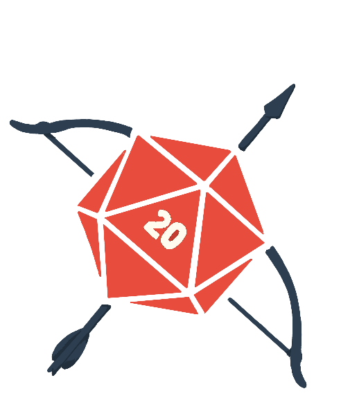

# RPG Hub - Projeto Completo de Startup

## Sumário Executivo

A RPG Hub é uma plataforma integrada que revoluciona a experiência de jogadores e mestres de RPG, oferecendo ferramentas intuitivas para criação, organização e personalização de campanhas.

---

## 1. Ideação

### 1.1 Problema Real
- Jogadores e mestres de RPG enfrentam dificuldades para organizar campanhas, criar mapas e fichas personalizadas, e conectar grupos de forma eficiente
- Recursos online existentes são fragmentados ou complexos para iniciantes
- Falta de integração entre ferramentas existentes aumenta custos e tempo de preparação

### 1.2 Solução Tecnológica
O aplicativo RPG Hub centraliza ferramentas essenciais:
- Criação de mapas interativos
- Fichas digitais customizáveis com suporte a sistemas populares
- Matchmaking para encontrar jogadores/grupos
- Biblioteca de campanhas prontas e gerador de histórias
- Sistema de áudio integrado para ambientação
- Ferramentas de automação para cálculos e rolagens

### 1.3 Público-Alvo
**Pesquisa de Mercado:**
- Tamanho do mercado global de RPG: US$ 2.1 bilhões (2023)
- Crescimento anual projetado: 13.7% até 2028
- 65% dos jogadores têm entre 18-35 anos
- 70% utilizam ferramentas digitais para jogar

**Segmentação:**
1. **Jogadores Iniciantes (30%)**
   - Buscam interface intuitiva
   - Preferem sistemas populares como D&D 5e
   - Valorizam tutoriais e suporte

2. **Mestres Experientes (40%)**
   - Necessitam ferramentas avançadas de customização
   - Dispostos a pagar por recursos premium
   - Criam conteúdo próprio

3. **Comunidades e Grupos (20%)**
   - Organizam eventos e campanhas longas
   - Precisam de ferramentas de gestão de grupo
   - Valorizam recursos de compartilhamento

4. **Criadores de Conteúdo (10%)**
   - Streamers e influenciadores
   - Vendem campanhas e materiais próprios
   - Buscam ferramentas de monetização

### 1.4 Análise de Concorrentes

| Característica | Roll20 | D&D Beyond | Foundry VTT | RPG Hub |
|---------------|--------|------------|-------------|----------|
| Preço Base | Gratuito | Gratuito | $50 único | Gratuito |
| Assinatura | $9.99/mês | $5.99/mês | N/A | $7.99/mês |
| Sistemas Suportados | Múltiplos | D&D apenas | Múltiplos | Múltiplos |
| Facilidade de Uso | Média | Alta | Baixa | Alta |
| Recursos Mobile | Limitado | Sim | Não | Completo |
| Marketplace | Sim | Sim | Sim | Sim |
| Customização | Média | Baixa | Alta | Alta |

---

## 2. Modelo de Negócio (Canvas)

### 2.1 Proposta de Valor
- Plataforma all-in-one para RPG
- Interface intuitiva e moderna
- Suporte multiplataforma (PC, Mobile, Tablet)
- Integração com sistemas populares
- Recursos de comunidade e social

### 2.2 Análise Financeira Básica

**Projeção para Primeiro Ano:**

```
Receitas:
- Assinaturas Premium (5000 usuários x $7.99 x 12 meses) = $479,400
- Marketplace (30% comissão sobre $200,000) = $60,000
- Parcerias e Anúncios = $40,000
Total Receitas: $579,400

Custos:
- Desenvolvimento e Manutenção = $200,000
- Marketing e Aquisição = $100,000
- Infraestrutura e Servidores = $50,000
- Equipe de Suporte = $80,000
- Custos Administrativos = $40,000
Total Custos: $470,000

Lucro Projetado Ano 1: $109,400
```

**Métricas Principais:**
- CAC (Custo de Aquisição de Cliente): $20
- LTV (Valor do Tempo de Vida do Cliente): $95.88
- Taxa de Conversão Freemium para Premium: 8%
- Churn Rate Mensal: 5%

---

## 3. Identidade Visual

### 3.1 Logo



### 3.2 Paleta de Cores
- Primária: #2C3E50 (Azul Profundo)
- Secundária: #E74C3C (Vermelho Vibrante)
- Neutros: #ECF0F1 (Cinza Claro)

### 3.3 Tipografia
- Títulos: Montserrat Bold
- Corpo: Open Sans
- Interface: Roboto

---

## 4. Plano de Marketing Digital

### 4.1 Cronograma de Lançamento

**Mês 1-2: Preparação**
- Desenvolvimento do MVP
- Criação de conteúdo inicial
- Estabelecimento de parcerias iniciais

**Mês 3: Soft Launch**
- Beta fechado para 500 usuários
- Coleta de feedback
- Ajustes de plataforma

**Mês 4: Lançamento Oficial**
- Campanha de marketing digital
- Eventos de lançamento
- Promoções especiais

### 4.2 Orçamento de Marketing (Primeiro Ano)

```
Q1: $30,000
- Desenvolvimento de Brand: $5,000
- Conteúdo Inicial: $10,000
- Influencer Marketing: $15,000

Q2: $25,000
- Mídia Paga: $15,000
- Eventos: $5,000
- PR: $5,000

Q3: $25,000
- Campanhas Sazonais: $10,000
- Conteúdo Contínuo: $10,000
- Parcerias: $5,000

Q4: $20,000
- Retenção: $10,000
- Expansão: $5,000
- Análise e Otimização: $5,000

Total: $100,000
```

### 4.3 Estratégia de Conteúdo

**Blog:**
- Guias para mestres
- Dicas de campanha
- Novidades do RPG Hub
- Cases de sucesso

**YouTube:**
- Tutoriais semanais
- Streams de demonstração
- Entrevistas com criadores
- Reviews de funcionalidades

**Newsletter:**
- Dicas semanais
- Novidades da plataforma
- Destaque de conteúdo da comunidade
- Promoções exclusivas

---

## 5. Protótipo Visual

**Telas Principais:**
1. Dashboard
2. Criador de Mapas
3. Gerenciador de Campanhas
4. Biblioteca de Assets
5. Perfil e Configurações

---

## 6. Métricas de Sucesso

### 6.1 KPIs Principais
- Usuários Ativos Mensais (MAU)
- Taxa de Conversão Premium
- Engajamento por Usuário
- NPS (Net Promoter Score)

### 6.2 Metas Primeiro Ano
- 50,000 usuários registrados
- 5,000 assinantes premium
- 4.5/5 média de avaliação
- 200 criadores ativos no marketplace

---

## 7. Próximos Passos

### 7.1 Roadmap Técnico
1. MVP com funcionalidades core
2. Integração com sistemas populares
3. Lançamento do marketplace
4. App mobile
5. Recursos avançados de customização

### 7.2 Expansão
- Localização para outros idiomas
- Parcerias com editoras
- Eventos presenciais
- Programa de embaixadores